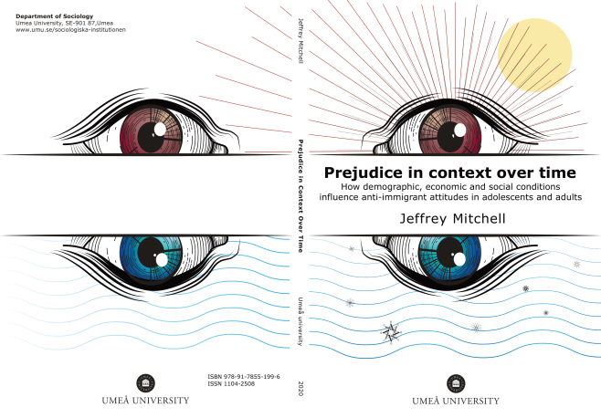

{width="400"}

My research sits at the intersection of attitudes and the effects of structural racism and discrimination in different societies. I defended my PhD dissertation in 2020 with the title '*Prejudice in contecxt over time: how demographic, economic and social conditions influence anti-immigrant attitudes in adolescents and adults'*. A full text of the introductory chapter, known in Sweden as the *kappa*, can be found [here.](http://umu.diva-portal.org/smash/get/diva2:1391008/FULLTEXT01.pdf) Since my defense, I have expanded my research to include political trust, and the effects of policing on society. My work has been published in various international peer-reviewed journals. Below I have some short summaries of these publications (and preprints) with links to the full texts.

**Mitchell, Jeffrey and Daniel La Parra.**"[**Who Gets the Blame and Who Gets the Credit? Policing, assistance, and political trust amongst the Roma in Europe**](https://osf.io/9vdc5)". *Preprint*\
Despite being Europe's largest ethnic minority, there is strikingly little systematic quantitative research on how experiences with the police, and other government agencies are related to the trust that the Roma place in political institutions. This study addresses this gap by using EU-MIDIS II data to assess the relationship between institutional trust and the experiences the Roma have with the police and assistance programs.We show that different experiences relate to trust in institutions differently: interactions with the police, either by being stopped or assaulted are most strongly associated with lower trust in the police and local government. In contrast, those who report having received assistance based on their minority membership are associated with modestly higher levels of trust across institution types. These results are consistent across the countries included in the analysis, and highlight the importance of institutional assistance and procedural justice in fostering or eroding trust amongst minority populations.

**Mitchell, Jeffrey and Guilherme Kenji Chihaya. 2022. "[Track Level Associations Between Historical Residential Redlining and Contemporary Fatal Encounters with the Police](https://www.sciencedirect.com/science/article/pii/S0277953622002957)" Social Science & Medicine.**\
How does structural racism influence where people are killed during encounters with police? We analyzed geo-located incidents of fatal encounters with police that occurred between 2000 and 2020 in Census tracts that received a classification by the Home Owners Loan Corporation (HOLC) during the 1930's. Hierarchal Bayesian Negative Binomial (HBNB) models show that incidents of fatal encounters with police in formerly redlined areas are 66% more likely than in zones that received the most favorable "A" rating. These differences remain even when tract historical and contemporary racial compositions, along with contemporary economic conditions, are taken into account. The effects of contemporary racial composition and economic conditions overshadow the effect of zone classifications only in areas with high proportions of Black residents or residents in poverty (\>60% or \>30% respectively). These findings provide evidence of structural biases in policing rooted in historical segregation policies.

**Czymara, Christian S., Jeffrey Mitchell. 2022.** "[**All Cops are Trusted? How Context and Time Shape Immigrants' Trust in the Police in Europe**](https://doi.org/10.1080/01419870.2022.2060711)" **Ethnic and Racial Studies.**\
In this study we examine first-generation immigrants' trust in the police in Europe from a comparative and longitudinal perspective. Based on roughly 20,000 immigrants observed in 22 countries over 13 years in the European Social Survey, results show that initially high levels of trust in the police among immigrants tend to erode with the length of their stay in the host country. We show that two simultaneous processes drive this pattern: a fading reference effect (downward assimilation) and an increasing discrimination effect. Cross-national comparisons show that, on average, immigrants in countries with more police trust the police less. However, there is no effect of police size within countries, mostly because police numbers hardly change over time. We discuss implications for future research and policy development based on our findings.

**Eger, Maureen A., Jeffrey Mitchell, and Mikael Hjerm. 2021.** "[**When I Was Growing Up: The Lasting Impact of Immigrant Presence on Native-Born American Attitudes towards Immigrants and Immigration.**](https://academic.oup.com/esr/advance-article/doi/10.1093/esr/jcab038/6365820#.YTfLnjLZX2Y.twitter)**"** **European Sociological Review.**\
Scholarship, including seminal research on prejudice, identifies adolescence as a critical period for the development of attitudes. Yet most sociological research on prejudice, especially in the form of anti-immigrant sentiment, focuses on the relationship between contemporaneous social conditions and attitudes towards out-groups while neglecting the demographic context during one's impressionable years. Therefore, we design research to investigate the relationship among temporally distal and temporally proximal sub-national contexts and native-born attitudes towards immigration and immigrants. To do this, we merge geocoded data from the General Social Survey (1994--2016) with a unique US state-level dataset (1900--2015). Results from multilevel models reveal that immigrant presence during adolescence is a more consistent predictor of attitudes towards immigration and immigrants in adulthood. Thus, while the majority of sociological research on anti-immigrant sentiment asks *if* societal conditions matter, our results suggest that a more important question is *when* the context matters.

**Mitchell, Jeffrey. 2021**. "[**Social Trust and Anti-Immigrant Attitudes in Europe: A Longitudinal Multi-Level Analysis**](https://www.frontiersin.org/articles/10.3389/fsoc.2021.604884/full)**.**" **Frontiers in Sociology.**\
Research investigating how social conditions influence attitudes about immigrants has focused primarily on demographic and economic factors as potential threat inducing contexts that lead to anti-immigrant sentiment. However, the empirical evidence supporting this link is mixed, while social cohesion indicators such as the influence of social trust, have largely been left unexamined. This article uses the European Social Survey (2002--2016) to test how differences in social trust, both within and between countries influence attitudes about immigrants. Results from longitudinal analyses show that countries with higher levels of social trust have more favorable attitudes toward immigrants, and while changes in social trust over time are small, they result in comparably large changes in anti-immigrant attitudes, even when controlling for other social factors. These results are robust across different model specifications and data sources.

**Mitchell, Jeffrey. 2019**. "[**Context and Change: A Longitudinal Analysis of Attitudes about Immigrants in Adolescence**](https://journals.sagepub.com/doi/10.1177/2378023119855157)." **Socius: Sociological Research for a Dynamic World**\
Research has explored many different relationships between contextual influences, such as levels of immigration or economic condition, and attitudes about immigrants, with mixed results. These have largely been international comparative studies using cross-sectional data, therefore they have been unable to make claims about changes in environmental context translating to changes in attitudes of respondents. Furthermore, the previous literature has almost exclusively tested these relationships using data from adults, despite research showing that attitudes are most subject to change during adolescence. This study addresses these issues by using a longitudinal data set of repeated measures of 2,328 German adolescents (about 14--18 years old) over four response waves (2010--2014). Using a multilevel analysis, results show that contextual changes, including the percentage of foreign-born people and unemployment rates within respondents' states, correspond to changes in attitudes toward immigrants consistent with group threat theory. These results were stable even when controlling individual-level factors.

**Mitchell, Jeffrey. 2019.** "[**Prejudice in the Classroom: A Longitudinal Analysis of Anti-Immigrant Attitudes**](https://www.tandfonline.com/doi/full/10.1080/01419870.2018.1493209)**.**" **Ethnic and Racial Studies**.\
This article analyses how the classroom context contributes to attitude change in adolescence. By analysing the relationship that the primary school classroom context has on anti-immigrant attitudes over time, it addresses the single factor fallacy that has troubled previous research on classrooms, which has largely tested the contact hypothesis. The dataset includes 849 participants over five-time points from 2010 to 2015. Findings show that over time individual's anti-immigrant attitudes increased in classrooms with a higher average level of anti-immigrant sentiment net of the effect of classroom heterogeneity. However, this finding was true only while students were still enrolled in the same class over the first three waves of the study. After students entered high school, the classroom/time interaction effect disappears, suggesting that other contextual influences take over. This article highlights the crucial importance of classroom context on attitude development in adolescence.
