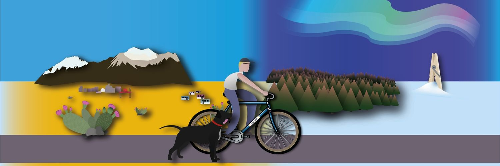

# \  

I am a sociologist and Associate Professor at the [department of sociology at Umeå University](https://www.umu.se/en/department-of-sociology/) in Sweden. My research focuses on a broad range of topics including prejudice, trust in political institutions, discrimination, and the effects of policing on society. I am particularly interested in how social change occurs over time, both within individuals and across societies, using longitudinal quantitative methods.

I am the Principal Investigator of two new research projects (started in 2024). The first project is titled [Labeling Neighborhoods: Assessing the neighborhood level impact of vulnerable area designations on health, crime, and trust](https://www.umu.se/en/research/projects/labeling-neighborhoods/) funded by the Swedish Research Council for Health, Working Life and Welfare (FORTE). This is a multi-university collaboration  that seeks to understand the consequences (both intended and unintended) of the expansive 'vulnerable areas' police list through the perspictive of spatial marking as a form of area based stigma. 

The second project is titled [Disentangling Discrimination in Europe: Patterns, processes, and consequences of discrimination experiences among multiple targeted groups in a comparative perspective](https://www.umu.se/en/research/projects/disentangling-discrimination-in-europe/) funded by the Swedish Research Council (VR). This project uses comparative survey data to get a better understanding of discrimination experiences and their consequences in Europe.

Both of these projects will run from 2024-2027.

My work has been published in a variety of international peer-reviewed journals including *European Sociological Review*, *Social Science & Medicine*, *European Societies*, *Ethnic and Racial Studies*, *Acta Sociologica*, and *Socius: Sociological Research for a Dynamic World* among others.

Below are a few links to recent publications but you can [download my CV here](CV.pdf), and visit my [google scholar page here](https://scholar.google.com/citations?user=w6B2J4kAAAAJ&hl=en)

**New Publications:**

-   Lindholm, Johan, and Jeffrey Mitchell. (Forthcoming 2026). ‘Låt den rätte komma in? Om urval till och resultat på juristutbildningen’. *Retfaerd*.

-   Eriksson-Krutrök, Moa and Jeffrey Mitchell. (Forthcoming 2026). ‘Memeing the moniker: The stickiness of gang myths in Swedish news legacy media and TikTok’. *New Media and Society*.

-   Mitchell, Jeffrey, and Daniel La Parra-Casado. 2025. “[Health Effects of Interpersonal and Structural Discrimination on Minority Groups in Europe](https://onlinelibrary.wiley.com/doi/10.1111/1467-9566.70054).” *Sociology of Health & Illness* 47 (5).

-   Mitchell, Jeffrey, Andrea Bohman, Maureen A Eger, and Mikael Hjerm. 2025. “[Rally around the Flag? Explaining Changes in Swedish Public Opinion toward NATO Membership after Russia’s Invasion of Ukraine](https://journals.sagepub.com/doi/10.1177/00016993241268185).” *Acta Sociologica* 68 (1): 30–40.

-   Mitchell, Jeffrey, and Daniel La Parra-Casado. 2024. “[Who Gets the Blame and Who Gets the Credit? Policing, Assistance, and Political Trust among the Roma in Europe](https://doi.org/10.1080/14616696.2023.2220014).” *European Societies* 26 (3): 718–39.
